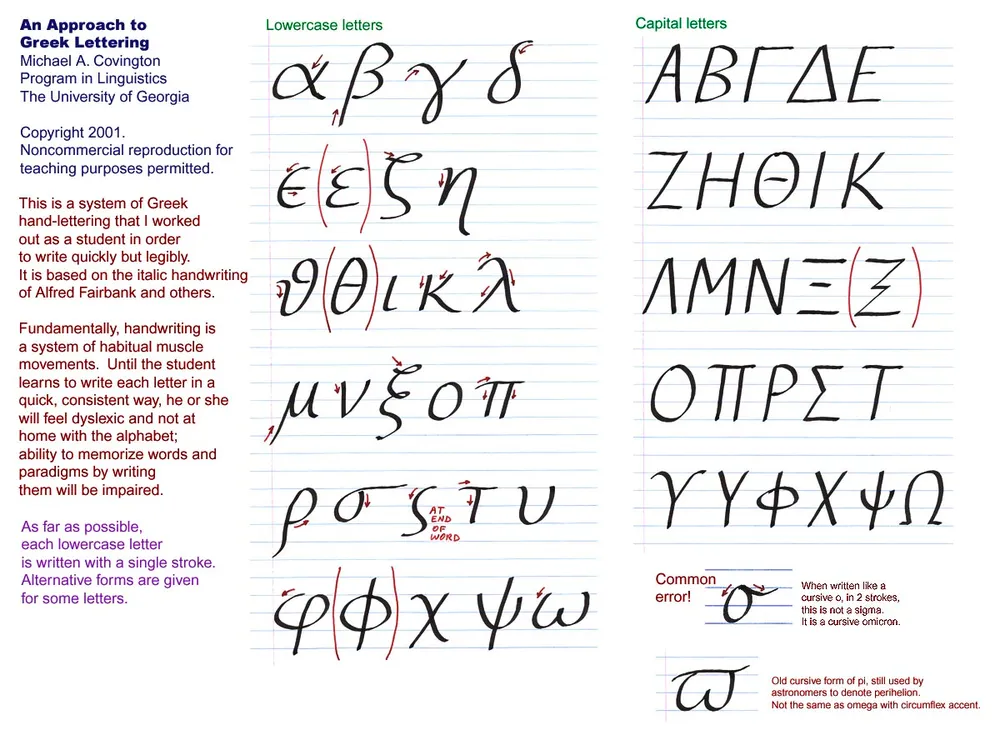

LaTeX 符号与希腊字母表

<!--more-->

## LaTeX 符号

<embed src="symbols.pdf" width="600" height="500" type="application/pdf">

https://www.cmor-faculty.rice.edu/~heinken/latex/symbols.pdf

https://oeis.org/wiki/List_of_LaTeX_mathematical_symbols

https://artofproblemsolving.com/wiki/index.php/LaTeX:Symbols

## 希腊字母表

| 希腊字母名称 | 大写 | 小写 | 常用含义或对应英文字母    |
| ------------ | ---- | ---- | ------------------------- |
| Alpha        | Α    | α    | a（常用于角度、系数）     |
| Beta         | Β    | β    | b（常用于角度、系数）     |
| Gamma        | Γ    | γ    | g（常用于伽玛射线、曲率） |
| Delta        | Δ    | δ    | d（Δ 表示变化量）         |
| Epsilon      | Ε    | ε    | e（常用于误差、介电常数） |
| Zeta         | Ζ    | ζ    | z（阻尼比）               |
| Eta          | Η    | η    | h（效率）                 |
| Theta        | Θ    | θ    | t（常用于角度）           |
| Iota         | Ι    | ι    | i（少用）                 |
| Kappa        | Κ    | κ    | k（波数、热传导率）       |
| Lambda       | Λ    | λ    | l（波长、特征值）         |
| Mu           | Μ    | μ    | m（微、摩擦系数）         |
| Nu           | Ν    | ν    | n（频率、黏度）           |
| Xi           | Ξ    | ξ    | x（随机变量）             |
| Omicron      | Ο    | ο    | o（少用）                 |
| Pi           | Π    | π    | p（圆周率）               |
| Rho          | Ρ    | ρ    | r（密度、电阻率）         |
| Sigma        | Σ    | σ/ς  | s（求和、标准差、应力）   |
| Tau          | Τ    | τ    | t（时间常数、剪切应力）   |
| Upsilon      | Υ    | υ    | u（少用）                 |
| Phi          | Φ    | φ    | f（磁通量、黄金比例）     |
| Chi          | Χ    | χ    | c（统计学中的卡方分布）   |
| Psi          | Ψ    | ψ    | ps（量子力学中的波函数）  |
| Omega        | Ω    | ω    | o（电阻、角速度）         |



https://gitcode.csdn.net/65ea82a51a836825ed7932f4.html

https://en.namu.wiki/w/%EA%B7%B8%EB%A6%AC%EC%8A%A4%20%EB%AC%B8%EC%9E%90

## 补充(to-do)

后面这坨之后有空补充和研究，并且需要更新一下之前的"hexo 图片引用"文章


```
## `<embed>`方法

<embed src="./2024-10-30-LaTeX-符号与希腊字母表/symbols.pdf" width="600" height="500" type="application/pdf">

<embed src="symbols.pdf" width="600" height="500" type="application/pdf">

## `<iframe>`方法

<iframe src="2024-10-30-LaTeX-符号与希腊字母表/symbols.pdf" width="600" height="500"></iframe>

<iframe src="symbols.pdf" width="600" height="500"></iframe>

## ``测试


```

```
update link as:-->/2024/10/30/2024-10-30-LaTeX-%E7%AC%A6%E5%8F%B7%E4%B8%8E%E5%B8%8C%E8%85%8A%E5%AD%97%E6%AF%8D%E8%A1%A8/LaTeX_logo.svg
```
