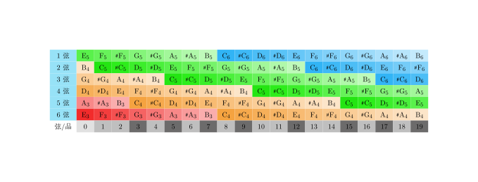

指板音阶（以及音乐相关，暂时先放这里）

<!--more-->

gpt 生成：

1. **Cmaj**:

- **Cmaj** 是 **C 大调和弦**（C Major）的缩写。
- C 大调和弦由 **C（根音）、E（大三度）、G（纯五度）** 这三个音组成。
- 这个和弦的特点是音色明亮、和谐，常用于许多流行、古典、摇滚等各种类型的音乐。

1. **add**:

- **add** 通常表示 **添加某个音** 到和弦中，但不改变和弦的基本性质。
- 例如，**Cmaj7add9** 就表示在 Cmaj7 和弦的基础上，添加了一个 9 度音（D）。
- **Cmaj add9** 表示在 C 大调和弦（C、E、G）的基础上加上了 9 度音 D，形成了一个 **C 大调 add9 和弦**。

1. **sus**:

- **sus** 是 **suspended**（悬挂和弦）的缩写，通常用来指代和弦中的 **第三音被替代**。
- 最常见的是 **sus2** 和 **sus4**：
  - **Csus2**：C、D（第二音）、G。
  - **Csus4**：C、F（第四音）、G。
- **sus** 和弦在和弦进展中常常用来“悬挂”或“拖延”最终的和弦解决，产生一种开放或不完全的感觉。

综合举例：

- **Cmaj add9**：C 大调和弦加上 9 度音 D，和弦音符为 C, E, G, D。
- **Csus4**：C、F、G，第三音（E）被 F 替代，产生悬挂效果。

这些和弦的组合可以创造出非常有趣的音响效果，也能增加和弦的复杂性和层次感。
