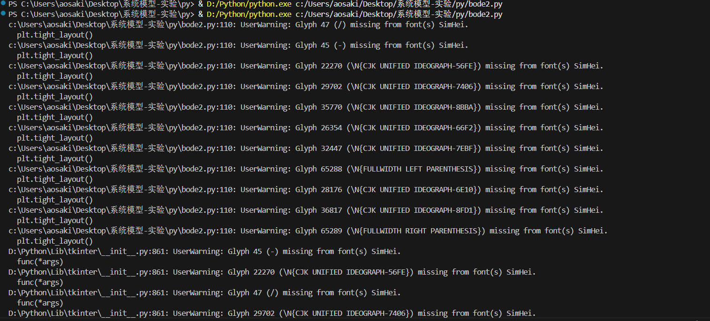

解决 matplotlib 中文乱码问题

<!--more-->

windows 下（各个系统都可能有这个问题），python 的 `matplotlib` 会出现**中文字体**以及**负号**乱码的现象，解决方案如下：

```py
import matplotlib.pyplot as plt

plt.rcParams['font.family'] = 'SimHei'
plt.rcParams['axes.unicode_minus'] = False
```

在 win 中，可以在 `powershell` 中运行命令 `fc-list :lang=zh family` 来优雅地查看系统上已安装的中文字体。

但有时也可能出现意想不到的问题：



虽然看着像字体不完整的问题，但其实是 `matplotlib` 自身的的**字体缓存**导致的问题。

一般缓存位置在系统的用户目录下的 `.matplotlib` ，在 win 中的文件是 `fontlist-v390.json` ，删除即可。

补充一点：仅仅使用中文字体可能会导致英文字体很丑，如果想要好看点可以这样写（注意优先级）：

```py
plt.rcParams["font.family"] = ["Arial", "SimHei"]
```
